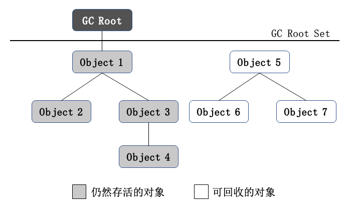

垃圾收集（Garbage Collection）需要确定的三件事：

* <a href="#如何确定哪些内存可以回收">哪些内存可以回收？</a>
* <a>什么时候回收？</a>
* <a>如何回收？</a>


程序计数器、虚拟机栈，本地方法栈三个区域，随线程而生，随线程而灭。方法或者线程执行结束，内存也就跟着回收了，所以这几个区域不用过多地考虑内存回收的问题。


**Java 堆和方法区是垃圾收集关注的主要区域**，因为程序在运行期间才知道会创建哪些对象，所以这部分区域，内存的分配和回收是动态的。


### <a name="如何确定哪些内存可以回收">如何确定哪些内存可以回收？</a>


垃圾收集器在对堆进行回收前，需要确定哪些对象可以被回收。首先，**确定哪些对象没有被引用**，先将这些对象清理掉。在这之后，如果内存还是紧张，**回收那些不重要的对象**。

如何确定对象有没有被引用？可以使用**引用计数算法或可达性算法**来分析。如何判断对象重不重要？可以根据对象的**引用强度**来判断。确定了对象可以被回收以后，对象也不是立刻就被回收掉的，需要经过两次标记。

方法区的回收效果没有栈的回收效果好，但是部分场景下还是需要对方法区进行回收。


#### 引用计数算法


给对象添加一个引用计数器，多一个地方引用该对象，其计数器值加 1，当一个引用失效，其计数器值减 1。当计数器值为 0 的时候，该对象将不会被引用，可以被回收。


引用计数算法（Reference Counting）**实现比较简单，判定效率也很高**，但是 Java 虚拟机并没有使用这种算法来管理内存，因为引用计数算法没法解决**对象间的循环引用问题**。


#### 可达性分析算法


可达性分析（Reachability Analysis）的思路是，将 **GC Roots 对象**作为起点，从 GC Roots 向下搜索，搜索所走过的路径称为**引用链（Reference Chain）**，当一个对象**到 GC Roots 没有任何引用链时**，则此对象不可用。如下图所示，Object 5、Object 6、Object 7 虽然互相之间有引用，但是到 GC Roots 是不可达的，所以这三个对象是可以回收的。




在 Java 语言中，可以作为 GC Roots 的对象：

* 虚拟机栈（栈帧中的本地变量表）中引用的对象
* 方法区中类静态属性引用的对象
* 方法区中常量引用的对象
* 本地方法栈中 JNI（Native 方法）引用的对象


#### 对象的引用强度


在 JDK 1.2 以前，Java 对引用的定义是，如果 reference 类型的数据中存储的是另一块内存的起始地址，就称这块内存代表着一个引用。所以，在这种定义下，对象就**只有被引用和没有被引用两种状态**。

我们希望能描述这样一类对象，**当内存足够时，能够留在内存中；如果内存在进行了垃圾收集后还是很紧张，就把这些对象抛弃**。为了实现这个功能，JDK 1.2 之后，Java 对引用的概念进行了扩充，将引用分为**强引用（Strong Reference），软引用（Soft Reference），弱引用（Weak Reference）和虚引用（Phantom Reference）**四种，这四种引用强度依次减弱。


强引用是指，在代码中普遍存在的，类似  Object ref = new Object() 的引用，只要强引用在，对象就不会被 GC


软引用是用来描述还有用但非必要的对象。软引用关联的对象，会在系统将要发生内存溢出之前，作为被回收的对象进行回收，如果此次回收后还是没有足够的内存，才会抛出异常。

```java
User user = new User();
SoftReference<Object> reference = new SoftReference<Object>(user);

reference.get();
```


弱引用也是用来描述非必要的对象，强度比软引用更弱，弱引用关联的对象只能存活到下次 GC，当垃圾收集器工作时，无论内存是否足够，都会回收掉弱引用关联的对象。

通过 WeakReference 对象的 get 方法获取实例，可能获取到 null。给 Reference 对象再传入一个 ReferenceQueue 对象，可以在对象被标记为可回收时，通过调用 isEnqueued 方法，得到 true 的返回值。

```java
User user = new User();
ReferenceQueue<User> referenceQueue = new ReferenceQueue<User>();
WeakReference<User> reference = new WeakReference<User>(user, referenceQueue);

reference.get();		// 可能为 null
reference.isEnqueued();	// 如果 user 被标记为可回收，返回 true
```


虚引用也被称为幽灵引用或者幻影引用，它是最弱的一种引用关系。一个对象是否有虚引用，不会影响它的生存时间。为对象设置虚引用的目的是，在对象被回收的时候能够收到一条系统通知。

```java
User user = new User();
ReferenceQueue<User> referenceQueue = new ReferenceQueue<User>();
PhantomReference<User> reference = new PhantomReference<User>(user, referenceQueue);

phantomReference.get();			// 永远为null
phantomReference.isEnqueued();
```


#### 两次标记和 finalize 方法


一个对象在进行了可达性分析后发现没有被引用，这个时候对象会被第一次标记。如果对象重写了 finalize 方法并且该方法之前没有被执行过，那么对象会被放到 F-Queue 队列中，由 Finalizer 线程去执行它的 finalize 方法。


如果在 finalize 方法中将对象重新与 GC Root 建立关联，那么该对象将不会被回收，否则执行完方法后对象将被第二次标记，然后被回收。


#### 回收方法区


方法区主要回收**废弃的常量和无用的类**。在大量使用反射、动态代理、CGLib等框架，动态生成 JSP 以及 OSGi 这类频繁自定义 ClassLoader 的场景，都需要虚拟机具有类卸载的功能。回收常量和类的过程与堆中回收对象的过程类似。


判定常量是否是废弃的比较简单，看是否被引用。判定类是否是无用的类比较苛刻，需要满足以下 3 个条件：

* 该类的所有实例都已被回收
* 加载该类的 ClassLoader 已经被回收
* 该类对应的 java.lang.Class 对象没有被引用，无法在任何地方使用反射访问类的方法

满足以上条件的类也不是一定会被回收，是可以被回收。是否对类进行回收，HotSpot 虚拟机提供了 ```-Xnoclassgc``` 参数进行控制，还可以使用 ```-verbose:class``` （Product 版）、```-XX:+TraceClassLoading```（Product 版）、```-XX:TraceClassUnLoading```（FastDebug版）来查看类加载和卸载的信息。

