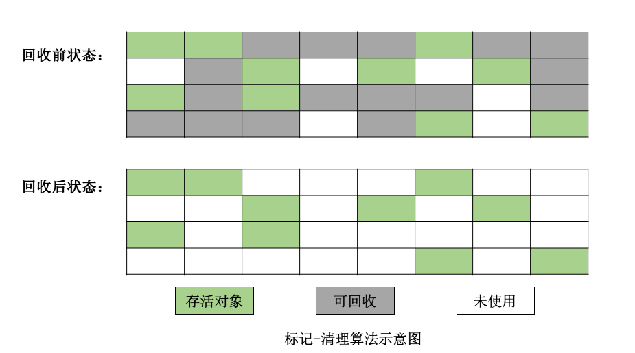
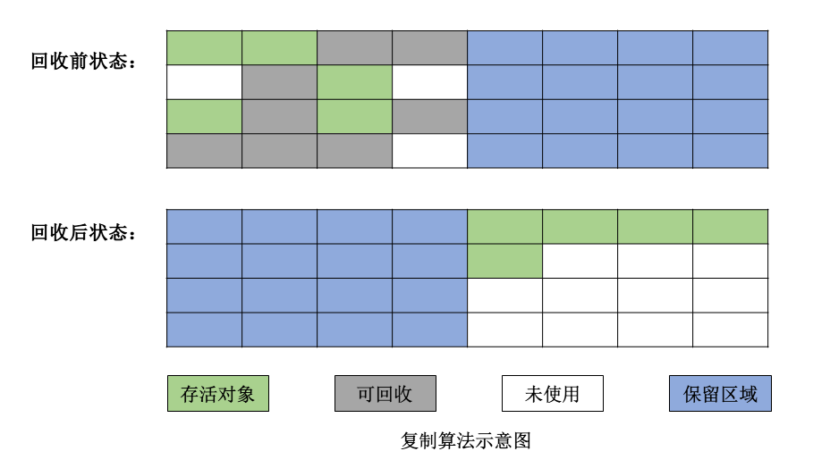
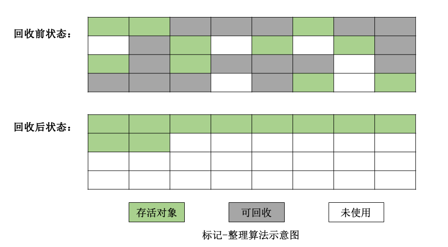

虚拟机确定了哪些对象是可以被回收的后，需要对相应的内存区域进行清理。如何清理这些内存，就是垃圾收集算法需要解决的问题。

本文会介绍 4 种垃圾收集算法，并且会介绍虚拟机在实现对象存活判定算法（可达性分析算法）和垃圾收集算法时，有哪些难点，并给出相应的解决方案。

### 基础收集算法：标记-清除算法

标记-清除（Mark-Sweep）算法是最基础的算法，过程分为两个阶段，**标记和清除**。首先标记出所有需要回收的对象（上篇文章介绍过，需要进行两次标记，第一次标记后可能会执行 Finalize 方法），在标记完成后统一回收所有被标记的对象。

该算法有两点不足：

1. 效率问题，标记和清除两个过程效率都不高。
2. 空间问题，标记清除之后，会产生大量的**不连续的内存碎片**，如果程序需要分配较大的对象，可能无法找到足够的连续的内存，而不得不再进行一次 GC。

### 升级方案1：复制算法

复制（Copying）算法是为了解决效率问题而从标记-清除算法演进而来的。它把可用内存分为大小相等的两块，每次只使用其中的一块。当这块内存使用结束后，就将还存活的对象一次性复制到另外一块内存，再将这块内存全部清理掉。

复制算法的优势是，每次都是对**半个区域**进行清理，效率高。清理后也**不会产生内存碎片**，分配内存时，只需要移动堆顶指针（指针碰撞），按序分配即可。实现简单，运行高效。

复制算法的缺点是，**可用内存变为原来的一半**，代价有点高。

现在的商业虚拟机使用这种算法来实现新生代，将内存分配为一块较大的 Eden 空间和两块较小的 Survivor 空间，HotSpot 虚拟机默认的 Eden : Survivor 1 : Survivor 2 = 8 : 1 : 1，使用 Eden 空间和 Survivor 1 空间。回收时，将 Eden 和 Survivor 1 上存活的对象复制到 Survivor 2 上，然后将 Eden 和 Survivor 1 清理掉。当 Survivor 2 空间不够时，需要依赖其他的内存（老年代）进行分配担保（Handle Promotion）。

### 升级方案2：标记-整理算法

复制算法在**对象存活率较高**的情况下需要进行较多的复制，效率会变低。并且如果不想浪费一半的内存而没有将内存等分，又需要额外的内存进行分配担保，以应对对象存活率较高的情况。所以老年代不适合用复制算法。

根据老年代的特点，提出另一种标记-整理（Mark-Compact）算法，标记的过程与标记-清除算法一致，但后续不是清理标记的位置，而是将所有存活的对象都往同一个方向进行移动，然后清理掉边界端以外的内存。

### 综合方案：分代收集算法

当前商业虚拟机的垃圾收集算法都采用分代收集（Genertional Collection）算法。这并不是一种新的算法，而是将内存分为新生代和老年代，每个分代根据实际情况采用最合适的收集算法。新生代每次收集都有大量对象死去，就选用复制算法。老年代对象存活率高，且没有额外的内存进行担保，就选用标记-清除或者标记-整理算法。

### 实现这些算法有哪些难点

可达性分析过程，需要从 GC Roots 节点开始寻找引用链，所以需要先**枚举根节点**。实现这个功能有一些难点：

1. 需要分析的范围太大，GC Roots 对象在全局性引用（常量或静态变量）和执行上下文（栈帧中的本地变量表）中都有，一些应用光方法区就几百兆，如果要逐个检查其中的引用，会消耗很多时间。
2. 必须要在一个能确保一致性的快照里进行，否则在枚举根节点的过程中，对象的引用关系还在不断地变化，那分析结果很可能是不准确的。

第二个难点的解决方案是，**在 GC 执行时，停顿所有的 Java 执行线程**（Stop the World），从而保证一致性。但是这种做法的代价也是比较大的，所以枚举根节点的过程越快越好，这也就对难点一提出了更高的要求。

HotSpot 针对难点一给出的解决方案是，采用**准确式 GC** 来提升枚举根节点的速度。所谓准确式 GC，就是让 JVM 知道内存中某个位置的数据是什么类型的，这样 JVM 很快就可以知道哪些位置上有引用数据，从而加快枚举的速度。

HotSpot 中，使用 OopMap（Ordinary Object Pointer Map） 来让 JVM 知道内存中每个位置的数据是什么类型的。在类加载完成后，HotSpot 就把对象内什么偏移量上是什么数据计算出来。在 JIT 编译过程中，也会在**特定的位置**记录下栈和寄存器中，哪些位置是引用。

#### 安全点和安全区域

JIT 编译过程中，只会在特定的位置，更新数据到 OopMap。因为会导致引用关系变化的指令非常多，如果每条指令都更新一下 OopMap，效率就比较低。所以只在特定的位置做更新，而这个位置就叫做安全点（Safepoint）。

所以，程序执行的过程，并不是所有的地方都可以停下来进行 GC 的，只有在安全点上才能进行 GC，要不然 OopMap 中的数据不一定准确，会影响 GC 的结果。

当程序执行时，可以在不长的时间内遇到安全点。那程序不执行时，比如线程处于 sleep 或 blocked 状态，就需要安全区域（Safe Region）来解决一致性的问题。

安全区域是指，一个对象的引用关系不会发生变化的代码片段，这个区域内任意位置开始 GC 都是安全的。当线程执行到安全区域的代码时，首先标识自己进入了安全区域，后面发生 GC 时，JVM 不会管这些进入安全区域的线程。在线程要离开安全区域时，必须检查系统有没有完成根节点的枚举，如果没有，则必须等收到可以离开的信号为止。所以那些后面可能会 block 的线程，在阻塞之前，线程就会声明进入安全区域，那 GC 的时候 JVM 就不会管他。后续可以执行了，要离开安全区域，也必须进行相应的检查，满足条件才能出安全区域，从而保证一致性。

**Q & A**

* 安全点是特定的位置，那这些位置应该如何选择？

如果安全点过少，那 GC 等待的时间会过长；如果安全点过多，会增大运行时的负荷。安全点选择以 “是否具有让程序长时间执行的特征” 为标准，包含循环的末尾、方法返回前、调用方法的 call 之后，抛出异常的位置。

* 如何让 GC 发生时，所有的线程（不包括执行 JNI 调用的线程）都跑到最近的安全点再停顿下来。

有两种可选方案：抢先式中断（Preemptive Suspension）和主动式中断（Voluntary Suspension）。

抢先式中断，在 GC 发生时，先把所有的线程全部中断，如果发现有线程中断的地方不在安全点上，就恢复线程让它跑到安全点上。

主动式中断，当 GC 需要中断线程的时候，设置一个标识，每个线程去轮询这个标识，如果这个标识为 true，线程就自己中断挂起。轮询标识的地方就是安全点和创建对象分配内存的地方。