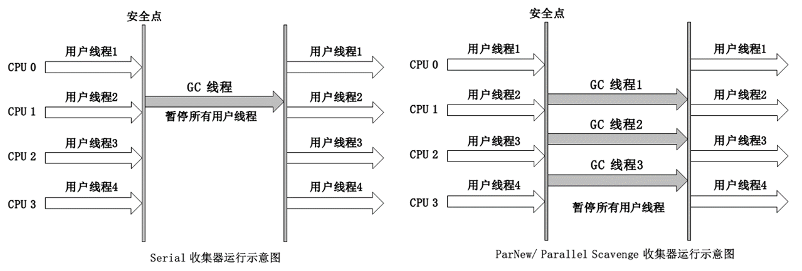

如果说垃圾收集算法是内存回收的方法论，那么垃圾收集器就是内存回收的具体实现。Java 虚拟机规范中对垃圾收集器应该如何实现并没有具体的规定，所以不同厂商，不同版本的虚拟机所提供的垃圾收集器有很大的差别。

本文介绍 JDK 1.7 Update 14 之后的 HotSpot 虚拟机中的 3 种用于新生代的垃圾收集器 ***Serial、ParNew 和 Parallel Scavenge***。


### 3 种收集器的横向对比


在介绍三种收集器之前先引入一个概念，串行收集、并行收集和并发收集。

串行（Serial）：只有***一条***垃圾收集线程。GC 线程工作时，其他工作线程处于***等待状态***。
并行（Parallel）：有***多条***垃圾收集线程同时工作。GC 线程工作时，其他工作线程处于***等待状态***。
并发（Concurrent）：垃圾收集线程工作的同时，工作线程***也在执行***，它们分别工作在不同的 CPU 上。


下面是这 3 种收集器的对比表以及运行示意图。


| 收集器名称         | Serial 收集器   | ParNew 收集器   | Parallel Scavenge 收集器 |
| ------------------ | --------------- | --------------- | ------------------------ |
| 使用算法           | 复制算法        | 复制算法        | 复制算法                 |
| 线程数             | 单线程          | 多线程          | 多线程                   |
| 收集方式           | 串行            | 并行            | 并行                     |
| 支持 GC 自适应调节 | 否              | 否              | 是                       |
| 可配合             | CMS、Serial Old | CMS、Serial Old | Serial Old、Parallel Old |





### Serial 收集器


Serial 收集器是一个使用复制算法的串行的新生代收集器。它只有一个 GC 线程，并且 GC 时会暂停所有的工作线程。不过 Serial 收集器却是是虚拟机 Client 模式下默认的收集器，因为它简单高效，没有线程切换的开销，在单核设备上的清理效率比使用多线程的收集器高。

比如说桌面应用，分配给虚拟机管理的内存不会很大，新生代一般几十兆到一两百兆。这种情况下使用 Serial 收集器，停顿的时间可以控制在 100 ms 以内，只要 GC 不是频繁发生，这点停顿还是可以接受的。所以 Serial 收集器对于运行在 Client 模式下的虚拟机是一个很好的选择。


### ParNew 收集器


ParNew 收集器是一个使用复制算法的并行的新生代收集器。它是运行在 Server 模式下的虚拟机首选的新生代收集器，有两点原因。

第一，ParNew 使用多线程进行垃圾收集，在服务器这种硬件资源比较好的设备上，多线程效率比单线程高。

第二，支持多线程的新生代收集器中，只有 ParNew 能与 CMS 配合使用。所以 ParNew 收集器是使用 ```-XX:+UseConcMarkSweepGC``` 选项后默认的新生代收集器。


### Parallel Scavenge 收集器


Parallel Scavenge 收集器是一个使用复制算法的并行的新生代收集器。它与 ParNew 收集器很相似，但是它关注的目标是达到一个可控制的吞吐量，而 ParNew 收集器关注的目标是缩短 GC 停顿时间。

吞吐量的计算公式如下图所示：


Parallel Scavenge 收集器提供了两个参数用于控制吞吐量，分别是控制最大垃圾收集停顿时间的```-XX:MaxGCPauseMillis```参数，和直接设置吞吐量大小的```-XX:GCTimeRatio```参数。

MaxGCPauseMillis 参数允许的值是大于 0 的毫秒数，收集器将尽量控制收集时间不超过设定的值。设置更小的收集时间会将降低吞吐率，***为了使收集时间更少，只能减少新生代内存的大小，也就导致 GC 发生地更频繁，吞吐量也相应地降低***。

GCTimeRatio 参数的值是大于 0 小于 100 的整数，是垃圾收集时间占总时间的比率，也就是吞吐量的倒数。比如参数值为 19，允许的最大的 GC 时间为 1/(1+19) = 5%

Parallel Scavenge 收集器还有一个参数```-XX:+UseAdaptiveSizePolicy```，这是一个开关参数，当开关打开后，就不需要手动设置细节参数了，***虚拟机会根据当前系统的运行情况收集性能监控信息，动态调整这些参数，以提供最适合的停顿时间或最大的吞吐量***，这种方式叫做 ***GC 自适应调节策略（GC Ergonomics）***。

>细节参数包括：
>
> * (-Xmn)：新生代大小
> * (-XX:SurvivorRatio)：Eden 与 Survivor 的比例
> * (-XX:PretenureSizeThreshold)：晋升老年代对象年龄


### Serial 对比 ParNew


ParNew 收集器其实就是 Serial 收集器的多线程版，ParNew 收集器除了使用多线程进行垃圾收集之外，其余的包括控制参数、收集算法、Stop The World、对象分配规则、回收策略等，都与 Serial 收集器一样。两种收集器确实也共用了很多代码。

在单 CPU 的硬件设备上，Serial 收集器的清理效率比 ParNew 收集器高。但随着可使用 CPU 数量的增加，ParNew 收集器在 GC 时对系统资源的利用率也在不断地增加。ParNew 收集器默认开启的收集线程数与 CPU 数量相同，也可以使用 ```-XX:ParallelGCThreads``` 参数来限制垃圾收集的线程数。


### ParNew 对比 Parallel Scavenge


ParNew 收集器关注的目标是尽可能缩短 GC 时的停顿时间，Parallel Scavenge 收集器关注的目标是达到一个可控制的吞吐量。停顿时间短适合用于需要与用户交互的程序，良好的响应速度能提升用户体验。高吞吐量可以高效的利用 CPU 时间，尽快完成计算任务，适合用于不需要太多交互的后台计算任务。

虽然 ParNew 收集器和 Parallel Scavenge 收集器的原理很相似，但是他们在实现上是完全不同的，没有共用实现的代码。